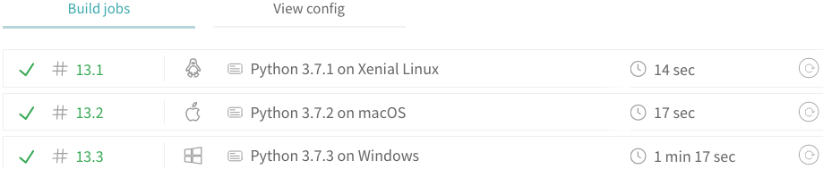

# Travis-CI: Testing with Python 3.7 on three different OSes

What is the [minimal __.travis.yml__](.travis.yml) file required to run the current Python on Linux, macOS, and Windows?



Ideally, it would be:
```yml
language: python
python: 3.7
os:
  - linux
  - osx
  - windows
install: pip3 install --upgrade pip
script: python3 platform-info.py
```
But what is currently required is: [__.travis.yml__](.travis.yml).  If any line looks optional, try removing it and see if the tests pass.

Setup times:
* ~__15 sec__ for Python 3.7.1 on Xenial Linux -- __dist: xenial__
* ~__15 sec__ for Python 3.7.2 on macOS 10.14.3 -- __osx_image: xcode10.2__
* ~__1 min 30 sec__ Python 3.7.3 on Windows 10.14.3 -- __choco install python__

Also see: https://github.com/cclauss/Travis-CI-Python-versions
